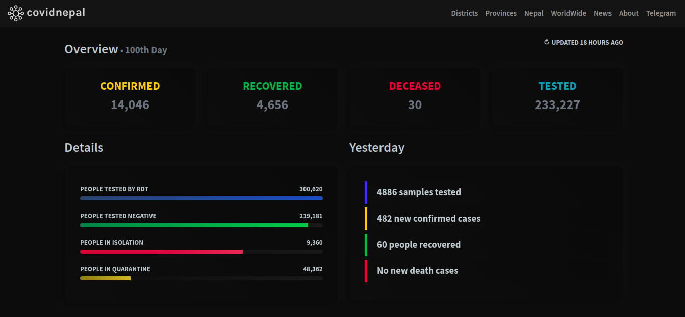

 
<strong>Yet another look into covid-19 cases in nepal</strong> 

 

## Introduction

**covidnepal** is just another try to look into covidcases inside Nepal.  It was made to cover reliable and more informational data as possible inside a same application. It depends on reliable API (after spending a months for it). This application uses PWA (Progressive Web App) technology, meaning it could be installed inside the browser easily like a mobile application and later could be run like an application. This application also follows **neumorphic** design style for UI & smoother animations for better UX.

### Features

* Lists covid-cases by districts & provinces
* Tracks cases worldwide live
* Auto updating covid related news & update
* Installable on any web browser & smartphones
* Alternate way of serving through telegram bot
* Neumorphic styled layout
* Dark mode enabled by default

### Links

<h4><a target="_blank" href="https://covidnepal.now.sh">Go to website | covidnepal.now.sh</a><h4>
<h4><a target="_blank" href="https://t.me/covidnepal_bot">Go to telegram bot | t.me/covidnepal_bot</a><h4>

## Prerequisites

* Node.js
* Yarn Package Manager
* Reliable API
* PWA Builder

## Used

#### Tools & Frameworks

* Vue : JS Framework
* Ionicons: Font Icons
* Inifinite-Loading: Loading posts infinitely
* Leaflet: Mapping JS Library
* Bootstrap 5: CSS Framework
* Anime: JS Library for Animation

 #### Websites

* <a target="_blank" href="https://realfavicongenerator.net/">realfavicongenerator.net</a>
* <a target="_blank" href="https://ionicons.com/">ionicons.com</a>
* <a target="_blank" href="https://tinypng.com">tinypng.com</a>
* <a target="_blank" href="https://metatags.io/">metatags.io</a>
* <a target="_blank" href="https://fonts.google.com/">fonts.google.com</a>
* <a target="_blank" href="https://vuejs.org">vuejs.org</a>

#### API Used

* <a target="_blank" href="https://documenter.getpostman.com/view/9992373/SzS7PkXr?version=latest">Postman | nepalcorona.info</a>

## Installation

Go to root folder & install the packages using: `yarn install`

## Development Setups

 To compiles and hot-reload for every changes: `yarn serve`

 To compiles & minify for production: `yarn build`

### Made with ❤️ in Nepal.