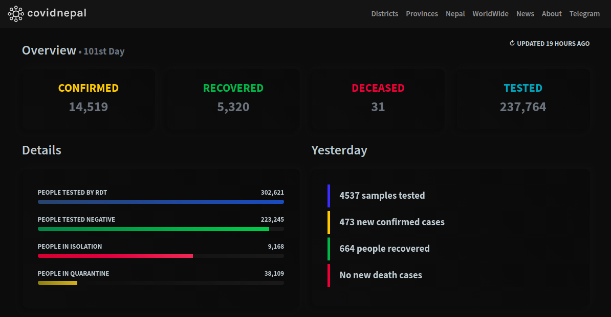
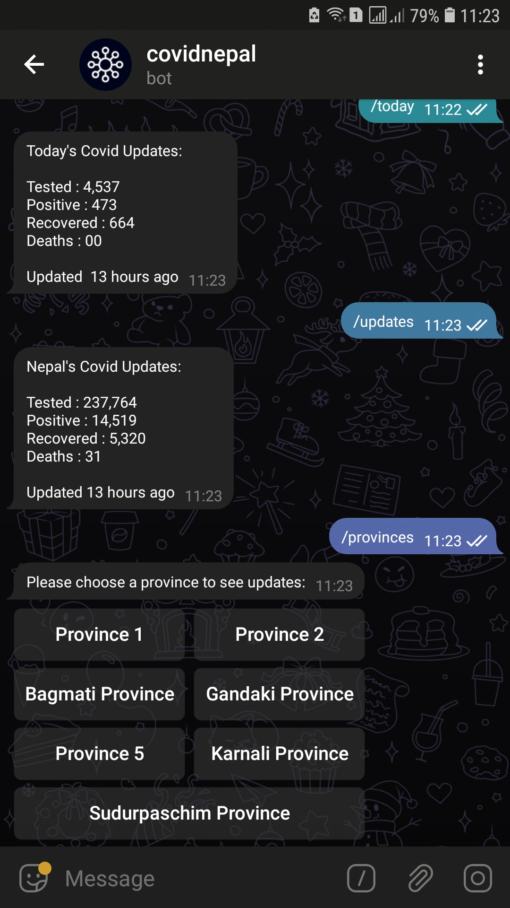
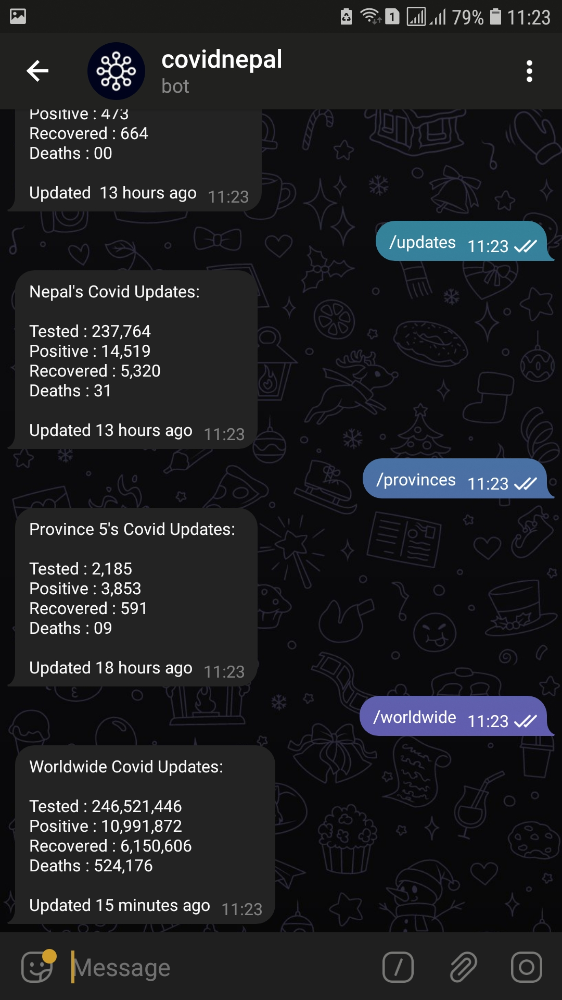

 
<strong>Yet another look into covid-19 cases inside nepal</strong> 

 

## Introduction

**covidnepal** is just "another try" to look into covidcases inside Nepal.  The main purpose of building this one again is to provide reliable, detailed & more informational data inside a same application. It depends on reliable API (after spending months for it). It is PWA based,(Progressive Web App) meaning it could be installed inside the browser easily like a mobile application and later it could be run offline. For UI/UX it uses dark **neumorphic** design & smoother animations.

### Features

* Lists covid-cases by districts & provinces
* Tracks live cases worldwide
* Infinitely loaded covid related news
* Installable on any web browser & smartphones
* Official telegram bot for alternate updates
* Neumorphic styled design
* Dark mode enabled by default

### Links

<strong><a target="_blank" href="https://covidnepal.now.sh">website > covidnepal.now.sh</a></strong> 
<strong><a target="_blank" href="https://t.me/covidnepal_bot">telegram bot > t.me/covidnepal_bot</a></strong> 
<strong><a target="_blank" href="https://progressiveapp.store/pwa/covidnepal">pwa store > progressiveapp.store/pwa/covidnepal </a></strong>

## Prerequisites

* Node.js
* Yarn Package Manager
* Reliable API
* PWA Builder

## Used

#### Tools & Frameworks

* Vue : JS Framework
* Ionicons: Font Icons
* Inifinite-Loading: Loading posts infinitely
* Leaflet: Mapping JS Library
* Bootstrap 5: CSS Framework
* Anime: JS Library for Animation

 #### Websites

* <a target="_blank" href="https://realfavicongenerator.net/">realfavicongenerator.net</a>
* <a target="_blank" href="https://autoprefixer.github.io/">autoprefixer.github.io</a>
* <a target="_blank" href="https://ionicons.com/">ionicons.com</a>
* <a target="_blank" href="https://tinypng.com">tinypng.com</a>
* <a target="_blank" href="https://metatags.io/">metatags.io</a>
* <a target="_blank" href="https://heymeta.com/">heymeta.com</a>
* <a target="_blank" href="https://fonts.google.com/">fonts.google.com</a>
* <a target="_blank" href="https://vuejs.org">vuejs.org</a>

#### API

* <a target="_blank" href="https://documenter.getpostman.com/view/9992373/SzS7PkXr?version=latest">Postman | nepalcorona.info</a>

## Installation

Go to root folder & install the required packages using: `yarn install`

## Development Setups

 To compiles & hot-reload for every changes: `yarn serve`

 To compiles & minify for production: `yarn build`

#### Contributions are welcome &bull; Made with ❤️ in Nepal.
